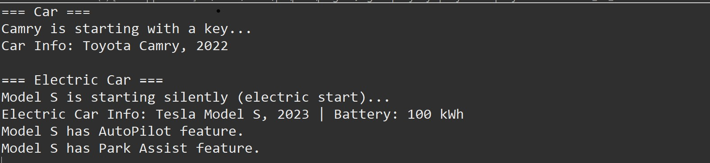

# Core Java

## Output Images

### 1. Java Basics

### 2. Loop Control

### 3. Strings and Arrays

### 4. Object-Oriented Programming (OOP)

### 5. Exception Handling
        

### 6. Collection Framework

### 7. Multithreading

### 8. JSON

### 9. XML

### 10. JDBC

### 11. File I/O

